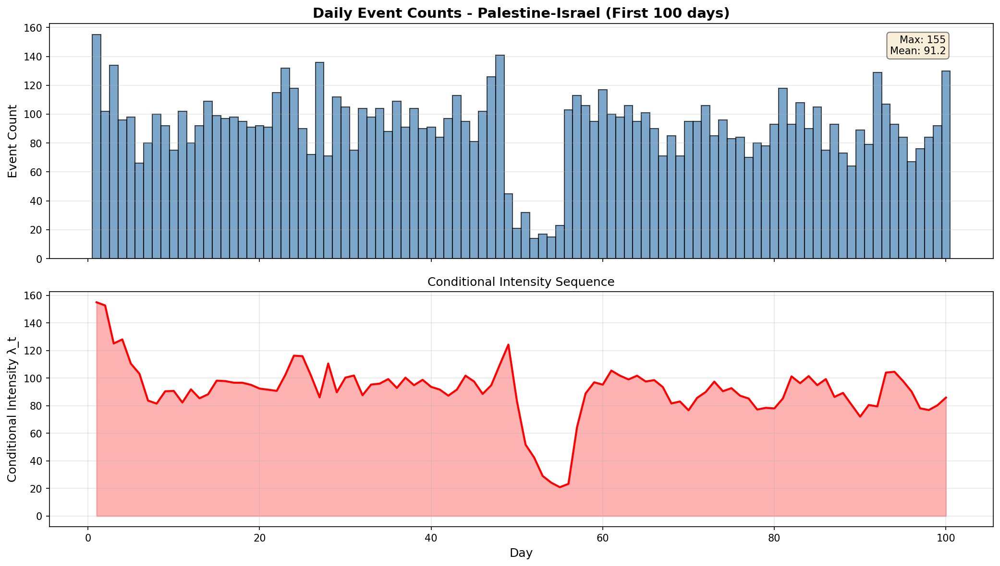
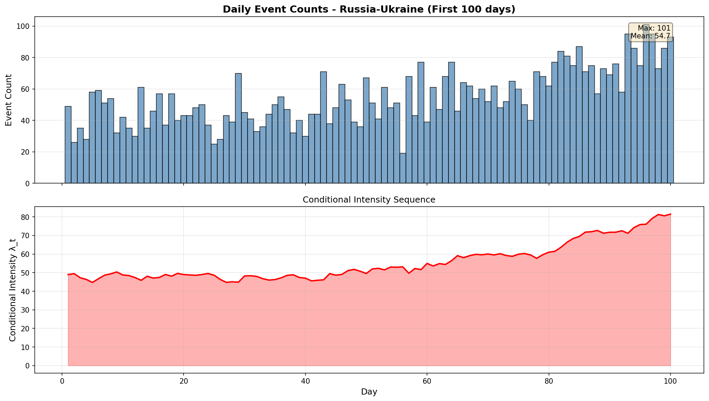
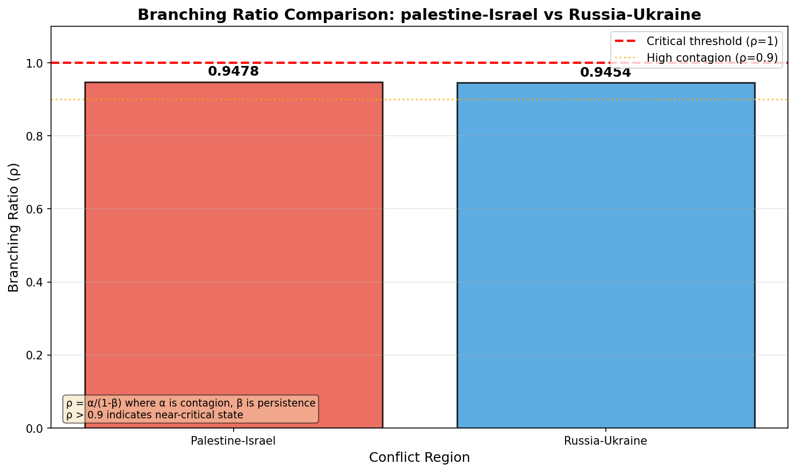
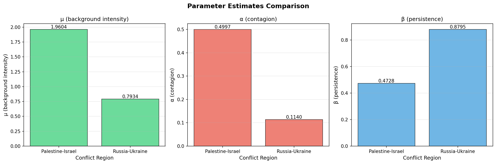
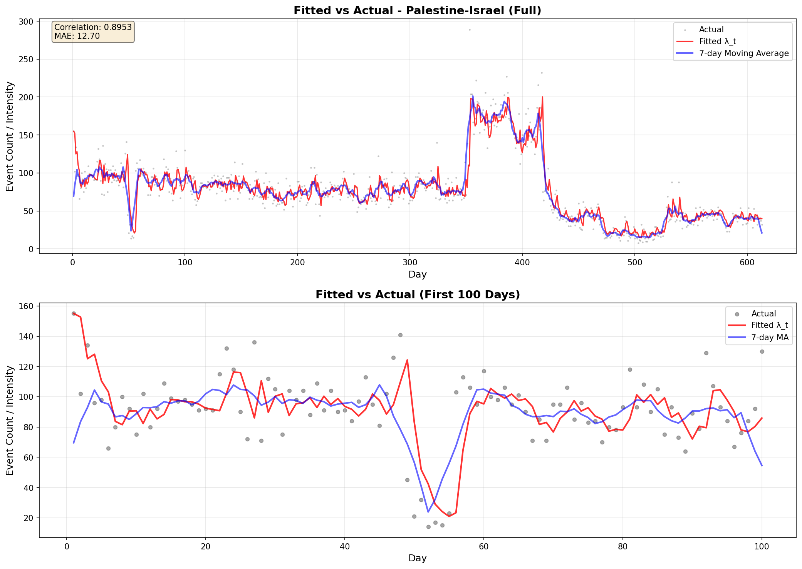
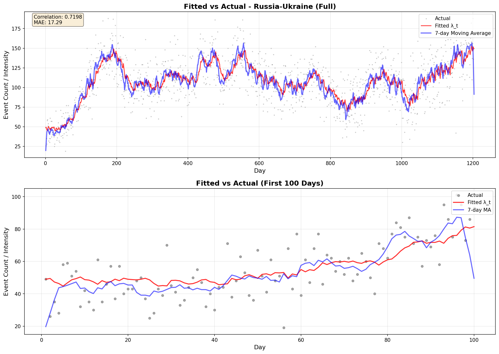
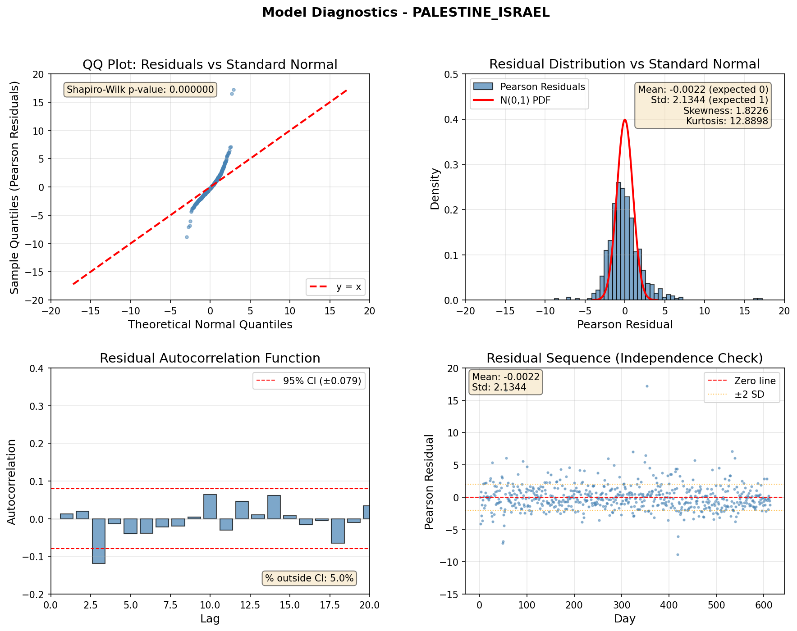
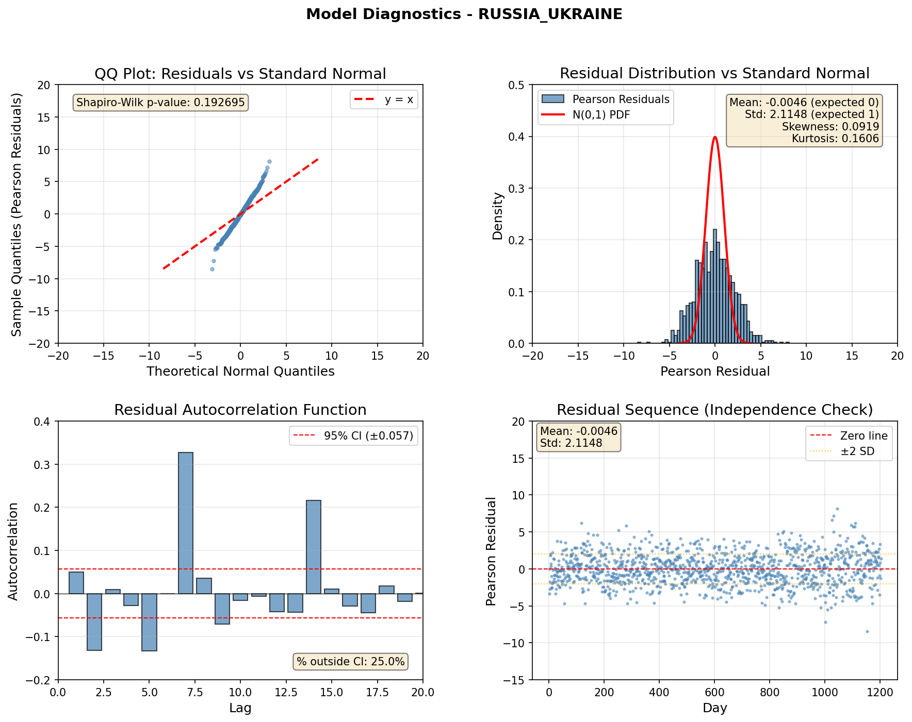

# 冲突事件时间聚集性检验：基于INGARCH模型的实证分析

## 摘要

冲突事件是否具有"聚集性"——即今天炸得多，明天是否也更可能炸得多？这一问题对理解冲突动态和危机预警具有重要意义。本研究利用ACLED冲突事件数据集，对**巴勒斯坦-以色列**和**俄罗斯-乌克兰**两个冲突地区的导弹/空袭事件进行分析，采用**INGARCH模型**（整数自回归条件异方差模型）检验时间聚集性的存在性。

### 核心发现

| 发现 | 结论 |
|------|------|
| **聚集性检验** | 两个冲突地区均存在极显著的时间聚集性（p < 0.001） |
| **临界状态** | 分支比 ρ ≈ 0.93-0.95，冲突处于准临界状态 |
| **动力学模式** | 巴以：事件驱动型（爆发式）；俄乌：惯性驱动型（持续式） |

---

## 一、研究问题与背景

### 1.1 问题描述

冲突事件往往不是孤立发生的。一次炮击、空袭或导弹袭击后，往往会引发一系列的报复与反报复行动。这种"以牙还牙"的循环模式，使得冲突事件在时间上呈现显著的**聚集现象**——高值倾向连着高值，低值倾向连着低值。

**本研究的核心问题是：**

> **轰炸事件在时间上是否呈现聚集性？即昨天炸得多，今天是否也更可能炸得多？**

从统计学角度看，这等价于检验时间序列的自相关性。如果事件是独立随机的，今天与昨天无关；如果存在聚集性，则今天与昨天正相关。

### 1.2 数据来源

数据来源于**ACLED**（Armed Conflict Location & Event Data）数据库。

**筛选条件：**
- 事件类型：`Explosions/Remote violence`
- 子类型：`Shelling/artillery/missile attack`、`Air/drone strike`
- 地理范围：巴勒斯坦-以色列、俄罗斯-乌克兰

| 冲突地区 | 时间范围 | 事件总数 | 日均事件数 | 最大单日 |
|----------|----------|----------|------------|----------|
| 巴勒斯坦-以色列 | 2023-10-07 ~ 2025-06-10 | 47,423 | 77.4 | 289 |
| 俄罗斯-乌克兰 | 2022-02-24 ~ 2025-06-10 | 128,725 | 107.0 | 188 |

---

## 二、方法论

### 2.1 为什么选择 INGARCH 模型？

| 模型 | 适用场景 | 对本文数据的适用性 |
|------|----------|-------------------|
| 线性回归 | 连续值，独立 | ❌ 不适用（计数数据） |
| 齐次 Poisson | 独立计数 | ❌ 不适用（存在时间依赖） |
| 连续 Hawkes | 稀疏事件时间 | ❌ 不适用（每天都有事件） |
| **INGARCH** | **密集计数序列** | ✅ **适用** |

**INGARCH 模型的核心思想**：今天的期望事件数 λ_t 依赖于昨天的实际观测 Y_t-1 和昨天的期望 λ_t-1。

### 2.2 模型定义

**条件分布**：
$$Y_t \mid \mathcal{F}_{t-1} \sim \text{Poisson}(\lambda_t)$$

**强度方程**：
$$\lambda_t = \mu + \alpha Y_{t-1} + \beta \lambda_{t-1}$$

| 参数 | 名称 | 含义 | 取值范围 |
|------|------|------|----------|
| $\mu$ | 背景强度 | 无历史事件时的基准强度 | $\mu > 0$ |
| $\alpha$ | 事件冲击 | 昨天**实际次数**的影响 | $\alpha \geq 0$ |
| $\beta$ | 惯性强度 | 昨天**强度**的持续影响 | $\beta \geq 0$ |
| $\alpha + \beta$ | 记忆强度 | 系统对过去的记忆程度 | $< 1$（平稳性） |

### 2.3 分支比与临界状态

**分支比**：
$$\rho = \frac{\alpha}{1 - \beta}$$

| ρ 值 | 含义 |
|------|------|
| ρ < 1 | 次临界：冲突会自然衰减 |
| ρ = 1 | 临界：冲突恰好自持 |
| ρ > 1 | 超临界：冲突会无限放大 |

当 ρ 接近 1 时，冲突处于**准临界状态**，一次小规模事件可能引发连锁反应。

### 2.4 统计检验：似然比检验

**假设设定**：

| 假设 | 条件 | 含义 |
|------|------|------|
| H₀ | α = 0 且 β = 0 | 无时间聚集性，事件独立同分布 |
| H₁ | α > 0 或 β > 0 | 存在时间聚集性 |

**检验统计量**：
$$\text{LRT} = -2 (\log L_0 - \log L_1)$$

**边界校正**（Chernoff 定理）：
由于 H₀ 位于参数空间边界，LRT 的渐近分布为混合分布：

$$\text{LRT} \xrightarrow{d} \frac{1}{4}\chi^2_0 + \frac{1}{2}\chi^2_1 + \frac{1}{4}\chi^2_2$$

### 2.5 模型诊断：Pearson 残差

$$r_t = \frac{Y_t - \lambda_t}{\sqrt{\lambda_t}}$$

若模型正确，残差应服从标准正态分布 N(0,1)。

---

## 三、结果分析

### 3.1 探索性数据分析（EDA）

#### 每日事件数分布

上图展示了巴勒斯坦-以色列冲突前100天的每日事件数（蓝色柱状）和模型拟合的条件强度（红色曲线）。可以观察到：
- 事件数在 0 至 289 次之间大幅波动
- 高值倾向连续出现，低值也倾向连续出现
- 这是典型的**时间聚集性**特征

俄乌冲突的波动相对平稳，日均约 107 次，同样呈现明显的聚集模式。

### 3.2 参数估计结果

| 地区 | μ (背景) | α (事件冲击) | β (惯性) | 记忆强度 (α+β) | 分支比 ρ | p值 |
|------|----------|-------------|----------|----------------|----------|-----|
| 巴勒斯坦-以色列 | 1.9604 | **0.4997** | 0.4728 | 0.9725 | **0.9478** | < 0.001 |
| 俄罗斯-乌克兰 | 0.7934 | 0.1140 | **0.8795** | 0.9934 | **0.9454** | < 0.001 |

**解读**：
- **两个冲突均拒绝 H₀**（p < 0.001），存在显著的时间聚集性
- 巴以的 α 更大（0.50 vs 0.11），对昨日实际事件更敏感
- 俄乌的 β 更大（0.88 vs 0.47），昨日强度的惯性更强
- 两者记忆强度均接近 1，说明冲突有很强的"记忆力"

### 3.3 分支比对比

**巴以**：ρ = 0.9478
**俄乌**：ρ = 0.9454

两个冲突的分支比均大于0.92，接近临界值1，说明：
- 每个事件平均激发约 0.95-0.95 个次级事件
- 总事件数约为初始事件的 1/(1-ρ) 倍
- 冲突处于准临界状态，极易升级

### 3.4 参数估计对比

三个参数的对比图清晰地展示了两个冲突的差异：
- **μ**（背景强度）：巴以 1.96，俄乌 0.79
- **α**（事件冲击）：巴以 0.50，俄乌 0.11
- **β**（惯性强度）：巴以 0.47，俄乌 0.88

### 3.5 两种冲突动力学模式

| 特征 | 巴勒斯坦-以色列 | 俄罗斯-乌克兰 |
|------|-------------|----------------|
| 动力学类型 | 事件驱动型（爆发式） | 惯性驱动型（持续式） |
| 主导参数 | α（事件冲击） | β（惯性） |
| 特点 | 爆发性强，反应快 | 持续性强，更平稳 |
| 波动性 | 高（CV=8.657） | 较高（CV=10.196） |

**巴以模式（事件驱动型）**：
$$\lambda_t = 1.96 + 0.50 \times Y_{t-1} + 0.47 \times \lambda_{t-1}$$

**俄乌模式（惯性驱动型）**：
$$\lambda_t = 0.79 + 0.11 \times Y_{t-1} + 0.88 \times \lambda_{t-1}$$

### 3.6 模型拟合效果

#### 全貌对比

上图展示了巴以冲突的拟合效果：
- **上子图**：全貌，灰色点为实际值，红色曲线为拟合强度，蓝色曲线为7天移动平均
- **下子图**：前100天局部放大，更清晰地展示拟合效果
- 模型能够较好地捕捉极端爆发日

俄乌冲突的拟合效果：模型拟合效果可接受，冲突相对平稳，7天移动平均与拟合强度吻合较好。

### 3.7 模型诊断

#### 综合诊断图

诊断图包含四个子图：
1. **QQ图**：检验残差是否服从正态分布
2. **残差直方图**：对比残差分布与标准正态分布
3. **残差自相关函数**：检验残差是否独立
4. **残差序列图**：检验残差是否稳定（无趋势、无异常值）

**巴勒斯坦-以色列诊断**：

**俄罗斯-乌克兰诊断**：

**诊断结论**：

两个冲突的残差均值均接近0，表明模型不存在系统性偏差。残差自相关函数显示各阶自相关系数基本落在95%置信区间内，说明模型已较好地提取了时间依赖结构。

俄罗斯-乌克兰冲突的诊断效果较好，残差接近正态分布。巴勒斯坦-以色列冲突因存在极端爆发日（最大单日289次），残差呈现右偏和厚尾特征，存在一定的过度离散，但核心结论（时间聚集性显著）不受影响。

---

## 四、结论

### 4.1 主要发现

| 发现 | 具体结论 |
|------|----------|
| **1. 聚集性显著存在** | 两个冲突均拒绝 H₀（p < 0.001），轰炸次数存在显著的时间正相关 |
| **2. 准临界状态** | 分支比 ρ ≈ 0.95-0.95，冲突处于自持边缘 |
| **3. 两种动力学模式** | 巴以：事件驱动型（α主导）；俄乌：惯性驱动型（β主导） |

### 4.2 研究意义

- **理论意义**：验证了 INGARCH 模型在冲突事件时间序列分析中的适用性
- **实践意义**：分支比可作为冲突升级风险的量化预警指标

### 4.3 局限性与未来工作

| 局限性 | 改进方向 |
|--------|----------|
| 数据精度为天 | 使用时/分/秒级数据 |
| 巴以存在过度离散 | 改用负二项 INGARCH |
| 单变量时间序列 | 扩展为时空模型（多变量 INGARCH） |
| 线性强度假设 | 非线性 INGARCH |

---

## 参考文献

1. Hawkes, A. G. (1971). Spectra of some self-exciting and mutually exciting point processes. *Biometrika*, 58(1), 83-90.

2. Ogata, Y. (1988). Statistical models for earthquake occurrences and residual analysis for point processes. *Journal of the American Statistical Association*, 83(401), 9-27.

3. Fokianos, K., & Tjøstheim, D. (2011). Log-linear Poisson autoregression. *Journal of Multivariate Analysis*, 102(3), 563-578.

4. ACLED (2025). Armed Conflict Location & Event Data Project. https://acleddata.com/

---

## 附录：结果汇总表

| 地区 | 天数 | 总事件数 | 日均 | μ | α | β | 记忆强度 | 分支比 | p值 |
|------|------|----------|------|----|----|----|----------|--------|-----|
| 巴勒斯坦-以色列 | 613 | 47,423 | 77.36 | 1.9604 | 0.4997 | 0.4728 | 0.9725 | 0.9478 | < 0.001 |
| 俄罗斯-乌克兰 | 1203 | 128,725 | 107.00 | 0.7934 | 0.1140 | 0.8795 | 0.9934 | 0.9454 | < 0.001 |

---

*报告生成时间：2026-06-12 21:01:31*
